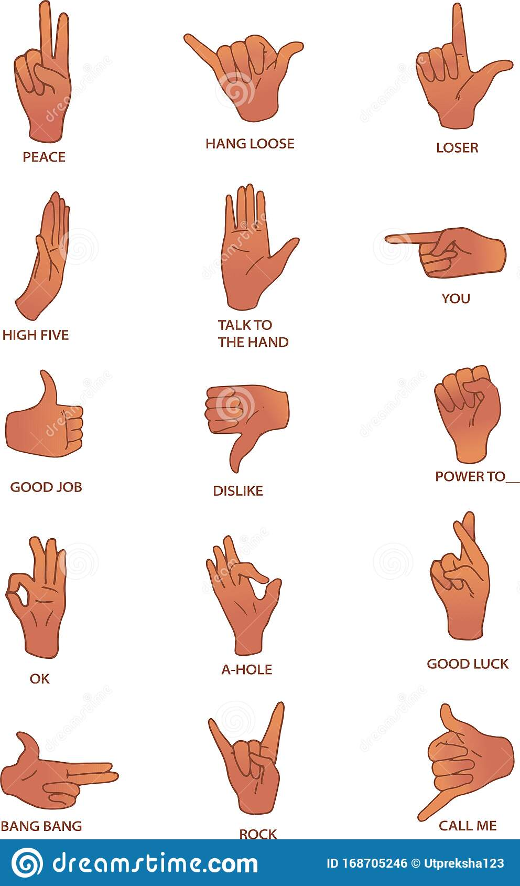

# Hand-Gesture-and-Signs-recognition
## this project is aimed to transalte sign language to plain English text by detecting multiple hand gesturnes and translating each
## Team Work:
- Bassem Yousry
- Ahmed Maged
- Ahmed Taha Fekry Taha
- Abdelrahman Adel
- Mohammed Essam
## Features:
- Translation of 10 different hand gestures and sign languages into plain English text
- possiblity of adding more gestures in the future without having to do it in development ( add gesture button )
## Future plans:
- Supporting voice in addition to the text to facilitate the communicaiton 
- support mobile verison of the app (facilitate the usage)
- support web app and connect it to the mobile app
- enhance the accuracy of our model

## example of the hand gestures recognized:

